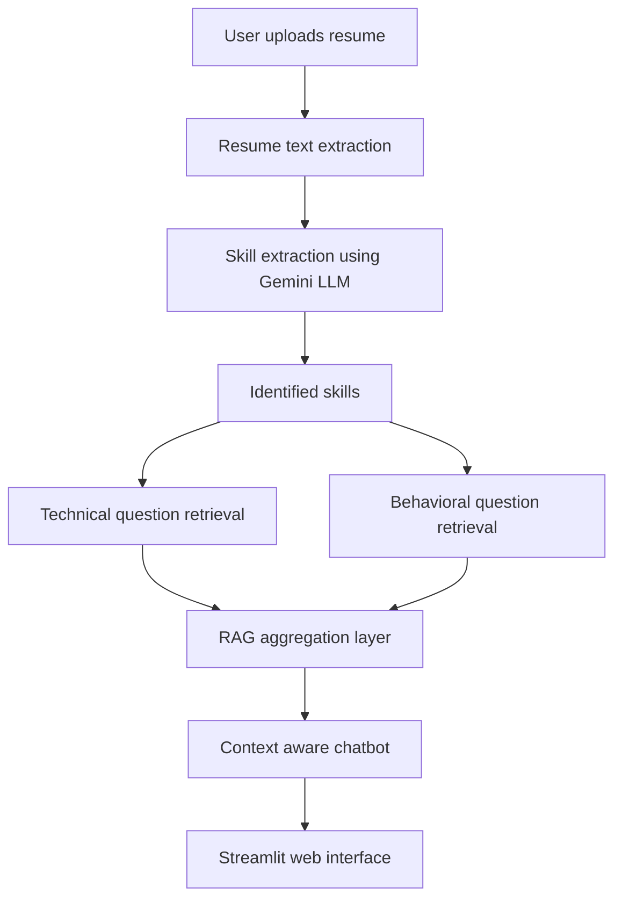

### AI-Powered Resume Analyzer & Interview Preparation System

An intelligent web application that analyzes resumes using a Retrieval-Augmented Generation (RAG) approach and generates personalized technical and behavioral interview questions.
This project helps users prepare efficiently for interviews by combining LLM-based reasoning with real-world interview question sources.

***Problem Statement:***

Interview preparation is often generic and time-consuming. Candidates struggle to identify which skills to focus on and which questions are most relevant to their profiles.

This system solves the problem by:

Automatically analyzing resumes

Extracting relevant skills using AI

Generating tailored interview questions

Providing an interactive chatbot for practice and feedback

***Features***

**Resume Upload & Parsing**

Supports PDF and DOCX resumes

Automatic text extraction

***AI-Based Skill Extraction***

Uses Google Gemini LLM

Identifies top technical and soft skills

**Retrieval-Augmented Generation (RAG)**

Combines LLM output with real interview questions

Scrapes data from trusted platforms

Multi-Source Question Retrieval

**Technical questions from:**

GeeksforGeeks

InterviewBit

Behavioral questions from:

The Muse

**Context-Aware Interview Chatbot**

Remembers extracted skills

Generates follow-up questions

Provides feedback on answers

**User-Friendly Web Interface**

Built with Streamlit

Session-based interaction handling

***Tech Stack***

Programming Language: Python

Frontend / UI: Streamlit

Large Language Model (LLM): Google Gemini (gemini-2.0-flash)

AI Architecture: Retrieval-Augmented Generation (RAG)

Resume Parsing: PyPDF, python-docx

Web Scraping & Retrieval: BeautifulSoup, Requests

Prompt Engineering: Skill extraction and context-aware querying

Session Management: Streamlit Session State

Environment Management: python-dotenv

APIs: Google Generative AI API

***System Workflow***

User uploads resume (PDF/DOCX)

Resume text is extracted

Gemini LLM analyzes resume and extracts key skills

Relevant interview questions are retrieved from multiple sources

Questions are aggregated using RAG

Context-aware chatbot is initialized

User interacts with AI for interview preparation

### Architecture Diagram

***Installation & Setup***

Clone the Repository:
git clone https://github.com/MS123-D/AI-ResumeAnalyzer.git
cd ai-resume-analyzer

Install Dependencies

pip install -r requirements.txt

Configure Environment Variables

Create a .env file in the project root:

GOOGLE_API_KEY=your_google_gemini_api_key

Run the Application

streamlit run app.py

***Usage***

Launch the Streamlit app

Upload your resume (PDF or DOCX)

Click Analyze Resume

View extracted skills and initial interview questions

Use the chatbot to:

Ask more questions

Practice answers

Get feedback

***Future Enhancements***

Answer evaluation with scoring

Resume improvement suggestions

Skill gap analysis

Offline question datasets

Multi-language resume support

***Acknowledgements***

Google Gemini API

GeeksforGeeks

InterviewBit

The Muse
